## Protocols in Python

----
Для того, щоб почати розглядати тему протоколів у Python, спочатку потрібно розібрати кілька тем, що наблизять нас 
до розуміння  протоколів та як їх використовувати. 
Тож спочатку розглянемо тему типізації: типізацію залом та типізацію саме у Python, зрозуміємо, як це повов'язано з 
протоколами, поговоримо про них, їх особливості та випадки, де їх використання буде гарним вибором, і порівняємо
протоколи з абстрактиними класами, бо це досить схожі поняття.

### Типізація

Є досить багато класифікацій типізацій, але нас наразі будуть цікавити дві.
За тим, як типи перевіряються під час виконання програми, розрізняють статичну та динамічну типізацію.
За тим, як типи визначаються і порівнюються між собою, розрізняють номінальну та структурну типізацію.

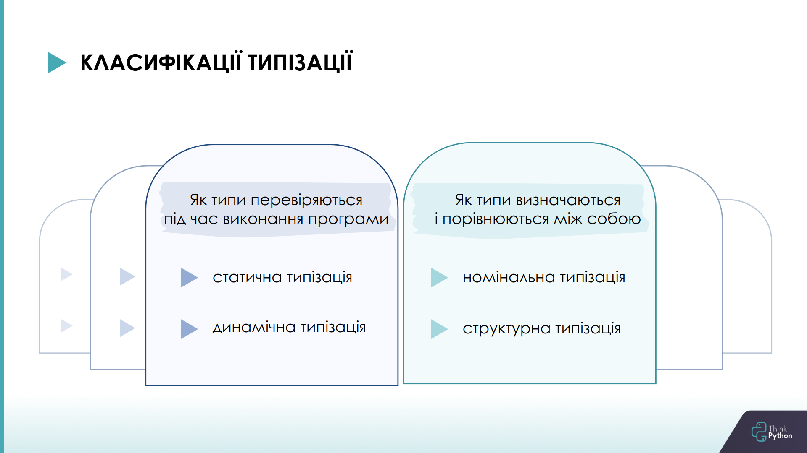

#### Статична та динамічна типізації

Python є мовою з динамічною типізацією, що означає, що типи даних визначаються автоматично при присвоєнні значень 
змінним, навідміну від статичної типізації, де типи даних визначаються в явному порядку під час компіляції програми.

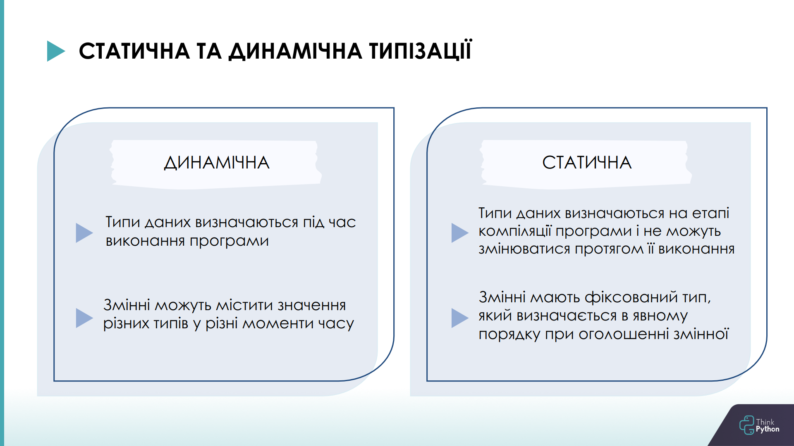

Щоб продемонстувати це та порівняти Python з іншими мовами програмування, давайте подивимось на реальний приклад:
маємо один і той самий код двома мовами - Python та Scala. Scala обрана просто як приклад мови зі статичною типізацією.

У коді на Python перший виклик функції `add()` виконає додавання цілих чисел і поверне число `5`. Другий виклик здійснює 
конкатенацію рядків і повертає строку `str1str2`. Типи даних об'єктів визначаються автоматично при присвоєнні значень 
змінним. Функція `add` може приймати аргументи різних типів даних (у даному випадку `int` та `str`) і повертати результат 
відповідного типу (у даному випадку `int` та `str`).

У той час, код на Scala використовує статичну типізацію, що означає, що типи даних аргументів і результату функцій 
визначаються заздалегідь і не можуть бути змінені під час виконання програми. У цьому випадку функції `add`
приймають аргументи відповідного типу і повертають результат відповідного типу.

<table>
<tr>
<td><center><strong> Python & Динамічна типізація </strong></center></td> 
<td><center><strong> Scala & Статична типізація </strong></center></td> 
</tr>
<tr>
<td>

```python
def add(x, y):
    return x + y


print(add(2, 3))
print(add('str1', 'str2'))       
```
</td> 
<td> 

```
object main extends App {
  def add(x: Int, y: Int): Int = {
    x + y
  }

  def add(x: String, y: String): String = {
    x + y
  }

  println(add(2, 3))
  println(add("str1", "str2"))
}
```
</td>
</tr>
</table>

Сильна сторона статичної типізації - можливість виявлення помилок під час компіляції коду. 
А в динамічно типізованих мовах подібні помилки проявляються лише під час виконання коду. 
Але з іншого боку, динамічна типізація може сприяти прискоренню створення прототипів програм, може допомогти в 
проведенні різних експериментів. Це одна з причин того, що Python набув величезної популярності.

#### Номінальна та структурна типізації

Ні номінальної, ні структурної типізації немає у Python, але ми їх розглянемо, згодом стане зрозуміло чому.

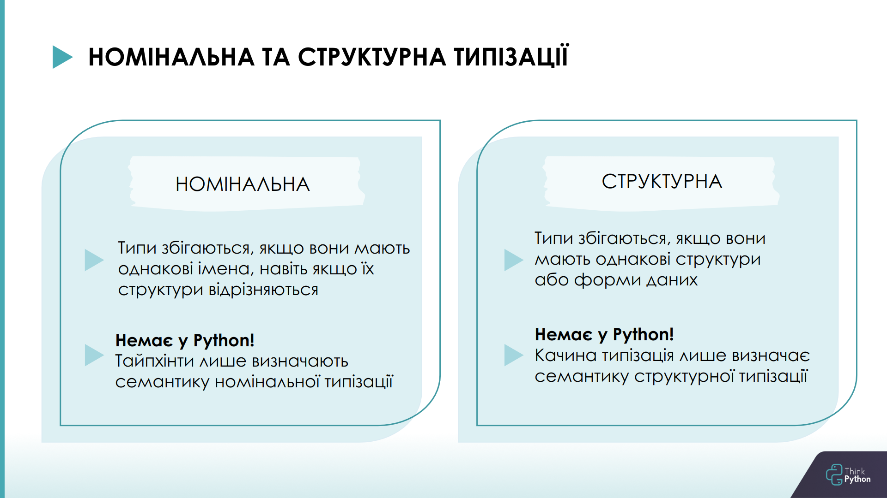

Почнемо з номінальної. Якщо простими словами, у випадку номінальної типізації типи збігаються, якщо вони мають 
однакові імена, навіть якщо їх структури відрізняються. Це напряму пов’язано з використанням ієрархії класів.

Подивимося приклади.
У коді на Scala реалізовано абстрактний базовий клас `Animal`, від нього успадковуємо клас `Cat` та НЕ успадковуємо 
клас `Dog`. І ми хочемо викликати функцію `makeSound()`, що прийме як аргумент якийсь `Animal` та викличе його метод 
`sound()`. У випадку класу `Cat` все спрацює, бо він є типом `Animal`, а у випадку класу `Dog` ми побачимо помилку про 
невідповідність типу. Саме так працює номінальна типізація.

Тепер той самий приклад на Python, якщо запустимо код, то він успішно відпрацює. Робимо те саме: створюємо абстрактиний 
базовий клас `Animal`, успадковуємо від нього клас `Cat` та НЕ успадковуємо клас `Dog`, і код працює, не зважаючи на те, 
що функція `make_sound()` очікує тип `Animal`. Тобто номінальна типізації в Python немає. 

Деякі новачки у Python, хибно вважають, що використання тайпхінтів якось впливає на те, як буде працювати код. 
Насправді ж тайпхінти є лише анотаціями і не впливають на реальну роботу програми, інтерпретатор взагалі видаляє 
тайпхінти при запуску коду, але вони можуть бути корисними для документування коду і використання сторонніми 
інструментами для перевірки типів (наприклад, `mypy`).

Якщо прибрати тайпхінт `Animal` з функції `make_sound()`, то ні `PyCharm`, ні `mypy` уже помилку не покажуть.
Бо тайпхінти лише визначають семантику номінального типу, а не реалізовують його у Python. 
Також можна зазначити, що при використанні ієрархії з абстрактним базовим класом як інтерфейсом, 
ми покладаємось саме на номінальне підтипування. 

<table>
<tr>
<td><center><strong> Python & Номінальна типізація (не реалізована) </strong></center></td> 
<td><center><strong> Scala & Номінальна типізація </strong></center></td> 
</tr>
<tr>
<td> 

```python
from abc import ABC, abstractmethod


class Animal(ABC):
    @abstractmethod
    def sound(self):
        print('...')


class Cat(Animal):
    def sound(self):
        print('Meow meow!')


class Dog:
    def sound(self):
        print('Woof woof!')


def make_sound(animal: Animal):
    animal.sound()


make_sound(Cat())
make_sound(Dog())
```
</td> 
<td> 

```
object main1 extends App {
  abstract class Animal {
    def sound(): Unit
  }


  class Cat extends Animal {
    def sound(): Unit = {
      println("Meow meow!")
    }
  }


  class Dog {
    def sound(): Unit = {
      println("Woof woof!")
    }
  }


  def makeSound(animal: Animal): Unit = {
    animal.sound()
  }

  makeSound(new Cat())
  makeSound(new Dog())
}
```
</td>
</tr>
<tr>
<td>
Результат запуску mypy:

```
error: Argument 1 to "make_sound" has 
incompatible type "Dog"; expected "Animal"
```
</td>
<td>
Помилка при виконанні коду:

```
type mismatch;
 found   : main1.Dog
 required: main1.Animal
  makeSound(new Dog())
```
</td>
</tr>
</table>

Структурна типізація - це підхід до типізації, де сумісність типів визначається на основі їх структури або форми даних.

Подивимося приклад.
У коді на Scala створимо новий тип `Animal` з методами `sound` та `eat` та успадкуємо від нього цього разу вже обидва 
класи: і клас `Cat`, і клас `Dog`. І так само у функції `makeSound()` викличимо `sound()` того `animal`, що прийде в 
функцію. Зауважимо, що і `Cat`, і `Dog` наразі є типом `Animal`. Але код не спрацює, бо у Scala реалізована структурна 
типізація, що вимагає від нас сумісності типів на основі структури, тобто наявності обох методів, як `sound`, так і `eat`, 
у класах послідовниках.

Як уже зазначалося вище, у Python структурної типізації немає, тож має все спрацювати.
Робимо те саме: створюємо новий тип `Animal`, успадковуємо `Cat` та `Dog` та у функції `make_sound()` передаємо об'єкти 
обох класів, і вони успішно викликають метод `sound()`. Бо зовсів неважливо, який саме animal у функцію прийде, 
щоб код спрацював, достатньо, щоб цей animal мав метод `sound()`.

<table>
<tr>
<td><center><strong> Python & Структурна типізація (не реалізована) </strong></center></td> 
<td><center><strong> Scala & Структурна типізація </strong></center></td> 
</tr>
<tr>
<td> 

```python
class Animal:
    def sound(self):
        print('...')

    def eat(self):
        print('...')


class Cat(Animal):
    def sound(self):
        print('Meow meow!')


class Dog(Animal):
    def sound(self):
        print('Woof woof!')

    def eat(self):
        print('Eats meat')


def make_sound(animal: Animal):
    animal.sound()


make_sound(Dog())
make_sound(Cat())              
```
</td> 
<td> 

```
object main2 extends App {
  private type Animal = {
    def sound(): Unit
    def eat(): Unit
  }

  class Cat extends Animal{
    def sound(): Unit = {
      println("Meow meow!")
    }
  }

  class Dog extends Animal{
    def sound(): Unit = {
      println("Woof woof!")
    }
    def eat(): Unit = {
      println("Eats meat")
    }
  }

  def makeSound(animal: Animal): Unit = {
    animal.sound()
  }

  makeSound(new Cat())
  makeSound(new Dog())
}
```
</td>
</tr>
<tr>
<td> 

</td> 
<td> 
Помилка при виконанні програми:

```
class type required but 
AnyRef{def sound(): Unit; def eat(): Unit} found
  class Cat extends Animal{
```
</td>
</tr>
</table>

І ось саме те, що нам не обов’язково мати точний тип об’єкту (`sound()` та `eat()`), а достатньо лише того, що ми 
беспосередньо використовуємо (`sound()`), демонструє принцип качиної типізації в Python.
Качина типізація, як ми подивилися, не є структурною типізацією, але вона визначає семантику структурної типізації, 
саме тому її часто називають структурною типізацією в динамічних мовах програмування.

#### Качина типізація

Для того, щоб пояснити, що таке качина типізація, використовують таке правило: "Якщо щось виглядає, як качка, плаває, 
як качка, і крякає, як качка, то це, ймовірно, і є качка". Але постає питання, що значить “виглядати”, “плавати” 
та "крякати" та що в реалії є цією качкою?


Качина типізація - це концепція, згідно з якою конкретний тип об'єкта (качки) не є важливим, а важливі лише властивості 
і методи, якими цей об'єкт володіє. Як це було з `Cat` та `Dog`: головне, щоб був метод `sound()`, все інше - не важливо. 
Такий підхід додає гнучкості коду, дає змогу поліморфно працювати з об'єктами, які ніяк не пов'язані один з одним 
і можуть бути об'єктами різних класів. Єдина умова - щоб усі ці об'єкти підтримували необхідний набір властивостей 
і методів (як наприклад, метод `sound()`).

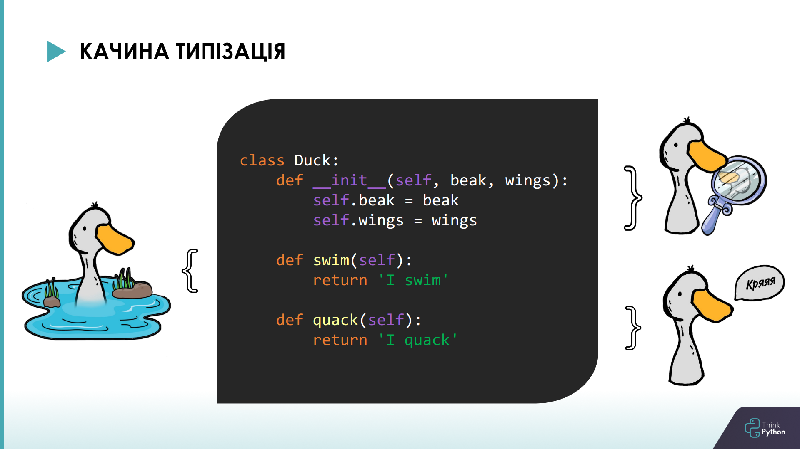

Але така гнучкість часто дає багато мінусів, бо ніхто не знає, що там прийшло, аби крякало. Якщо не крякає, це ваші 
проблеми, треба було перевіряти тестами. 

Але у Python є спосіб реалізувати структурну типізаціїю та зобов’язати `Cat` та `Dog` реалізовувати необхідні методи. 
І це протоколи.

Але, напевно, комусь з вас зараз спало на думку щось типу “Стоп, нащо нам якісь протоколи, якщо можна просто зробити 
`Animal` абстрактним базовим класом та зобов'язати послідовників виконувати необхідні методи, у даному випадку `sound()` 
та `eat()`, і все спрацює як належить”. 

```python
from abc import ABC, abstractmethod

class Animal(ABC):
    @abstractmethod
    def sound(self):
        print('...')

    @abstractmethod
    def eat(self):
        print('...')
# ...
```

Насправді так, протоколи та абстрактні класи - досить схожі поняття, і ми повернемося до цього питання, 
коли розглянемо протоколи.

### Протоколи

#### Протокол ітератора

Навіть якщо ви не використовували безпосередньо протоколи в Python, ви точно чули такий вираз як протокол ітератора. 
Давайте за допомогою нього познайомимось з протоколами. Протоколи в Python є угодами про те, як мають поводитися об'єкти 
і які методи вони мають реалізовувати. У контексті протоколу ітератора Python очікує, що об'єкти, які підтримують 
ітерацію, будуть реалізовувати методи `__iter__()` і `__next__()`. Однак є також зручний вбудований тип даних, який 
автоматично реалізує цей протокол - це ітеровані об'єкти, такі як списки, кортежі, строки і словники.

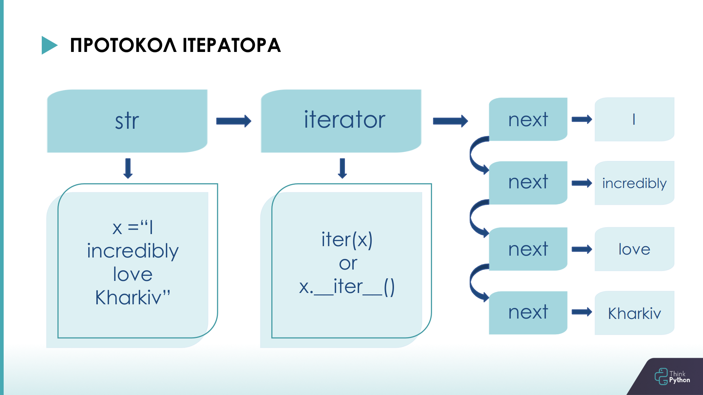

Подивимось приклад. Бачимо реалізацію ітератора для проходження по числам Фібоначчі. У випадку ітератора протокол визначає 
методи `__iter__()` та `__next__()`. Клас, що реалізує ці методи, вважається ітератором. Він може бути використаний у 
будь-якому контексті, де очікується ітеруємий об'єкт, такому як цикл `for`, генератор списку або функція `list()`. 
Якщо хоча б один з методів не буде реалізовано або буде реалізовано некоректно, то ітератор працювати не буде, бо ми 
не виконали умови протоколу ітератора.

```python
from typing import Iterable, Iterator


class Fibonacci(Iterable[int]):
    def __init__(self, max_number: int):
        self.max_number = max_number
        self.first, self.second = 0, 1

    def __iter__(self) -> Iterator[int]:
        return self

    def __next__(self) -> int:
        if self.first > self.max_number:
            raise StopIteration
        current = self.first
        self.first, self.second = self.second, self.first + self.second
        return current


fib_sequence = Fibonacci(10)
for number in fib_sequence:
    print(number)
```

Таким чином можемо зробити висновок, що протоколи в Python визначають "інтерфейси", що описують очікувані атрибути і 
методи і за необхідності організовують перевірку наявності всього цього у відповідних класах. Механізм протоколів 
з’явився в версії Python 3.8, і він є способом реалізації структурної типізації в Python.

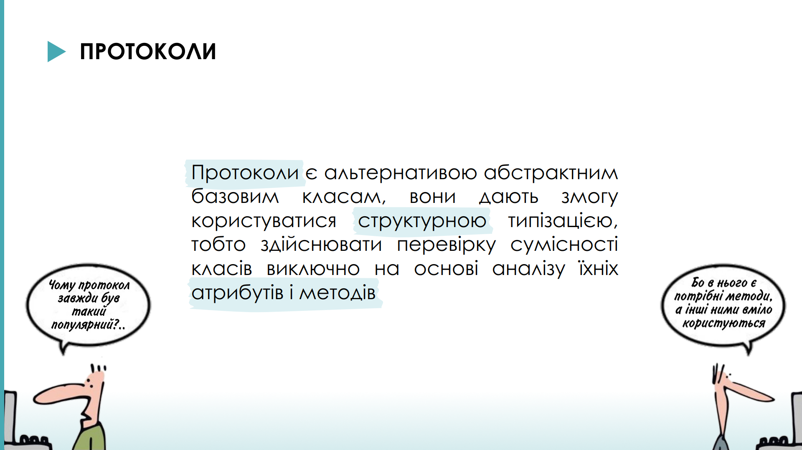

#### Протоколи

Окрім вже вбудованих, ми можемо створювати і власні протоколи.
Клас, що декларує протокол, має бути дочірнім класу `Protocol`, визначеного в модулі `typing`. Атрибути і методи, 
перелічені в тілі класу-протоколу, мають бути реалізовані у всіх класах, що відповідають цьому протоколу. У загальному 
випадку тіло методів класу-протоколу не має значення (хоча й існує можливість додати реалізацію методів за замовчуванням).

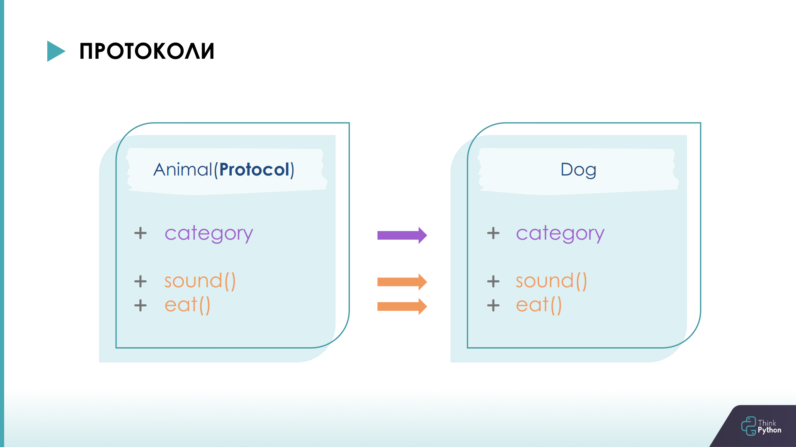

Повертаємося до наших котів та собак. Маємо клас протоколу, що спадкується від `Protocol` з модуля `typing`, реалізації 
методів протоколу зазвичай немає. Маємо клас `Dog`, що реалізовує всі атрибути та методи класу протокола. І у функції 
`make_sound()` ми вказуємо, що хочемо отримати об’єкт, що відповідає протоколу `Animal`, а саме має методи `sound()` та 
`eat()` та атрибут `category`. 

```python
from typing import Protocol


class Animal(Protocol):
    category: str

    def sound(self) -> str:
        pass

    def eat(self, food: str) -> str:
        pass


class Dog:
    category = 'pet'

    def sound(self) -> str:
        return f'Dog with category {self.category} sound like Woof woof!'

    def eat(self, food: str) -> str:
        return f'Dog with cat {self.category} eat {food}'


def make_sound(animal: Animal):
    return animal.sound()
```

Якщо реалізація протоколу буде не коректною, то `mypy` повідомить про помилку. Наприклад, закоментуємо метод `eat()` у 
класі `Dog`.

```
error: Argument 1 to "make_sound" has incompatible type "Dog"; expected "Animal"
note: "Dog" is missing following "Animal" protocol member:
note:     eat
```

Як бачимо, `mypy` не тільки повідомляє про помилку в коді програми, а й підказує, який метод протоколу не реалізовано 
або реалізовано неправильно. Для прикладу приберемо аргумент `food` з методу `eat()` класу `Dog`, в результаті чого метод 
протоколу буде реалізовано некоректно, і `mypy` покаже помилку.

```
error: Argument 1 to "make_sound" has incompatible type "Dog"; expected "Animal"
note: Following member(s) of "Dog" have conflicts:
note:     Expected:
note:         def eat(self, food: str) -> str
note:     Got:
note:         def eat(self) -> str
note:     Expected:
note:         def eat(self, food: str) -> str
note:     Got:
note:         def eat(self) -> str
```

#### Декоратор runtime_checkable

Здебільшого протоколи не призначені для перевірок відповідності об'єктів тому чи іншому протоколу на етапі виконання 
програми. Для того, щоб це стало можливим, використовують декоратор `@runtime_checkable`. Це означає, що коли ми створюємо 
об'єкт певного класу, ми можемо перевірити, чи можна розглядати його, як екземпляр певного протоколу безпосередньо під 
час виконання програми.

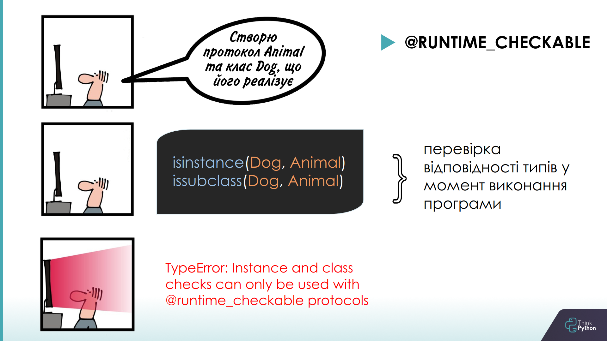

Подивимося приклад. Маємо клас протоколу та клас, що реалізовує цей протокол. Без використання декоратору 
`@runtime_checkable` ми побачимо помилку виконання коду, декоратор додає можливість для перевірок відповідностей типів 
у момент виконання програми.

```python
from typing import Protocol, runtime_checkable


@runtime_checkable
class Animal(Protocol):
    def sound(self):
        pass


class Dog:
    def sound(self):
        print('Woof woof!')


print(isinstance(Dog(), Animal))
```

Маємо ще один приклад: протокол, що зобов’язує реалізувати метод `__len__`, перевірка виконується для строки та списку,
які мають цей метод, тож ми отримаємо у результаті `True`.

```python
from typing import Protocol, runtime_checkable


@runtime_checkable
class HasLength(Protocol):
    def __len__(self) -> int:
        pass


print(isinstance('Duck', HasLength))
print(isinstance([1, 2, 3], HasLength))
```

#### Ієрархія протоколів

Протоколи, як і звичайні класи, можуть бути в ієрархії. Але для цього мають виконуватися певні умови.
По-перше, щоб клас вважався протоколом, він повинен успадковуватися від `typing.Protocol`. Ця явна вимога забезпечує 
ясність ролі класу, як протоколу. Вона відрізняє звичайні класи, які можуть мати схожу структуру, але не служать 
протоколами, від реальних класів протоколів.
По-друге, в ієрархії, що включає протокол, усі класи в ланцюжку успадкування мають бути протоколами. Це правило 
гарантує, що принципи структурної типізації, на яких засновані протоколи, послідовно підтримуються у всьому ланцюжку 
успадкування.
І останнє - протокол не може розширювати непротокольний клас. Це обмеження запроваджено для збереження цілісності та 
мети протоколів. Оскільки протоколи призначені для визначення поведінки (інтерфейсів), а не конкретних реалізацій, 
то успадкування від звичайного класу може призвести до появи певних станів, що суперечить фундаментальній концепції 
протоколів.

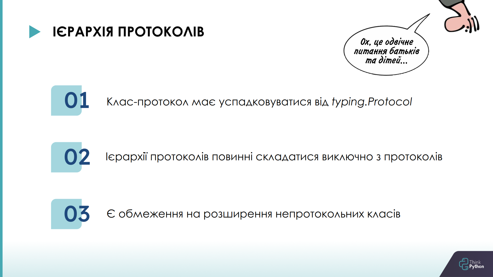

### Абстрактні базові класи

Отже, протоколи ми розглянули, тому можемо повернутися до питання, у чому ж принципова різниця протоколів та абстрактних 
базових класів.

Абстрактні базові класи у Python надають механізм визначення інтерфейсів. Інтерфейс же у свою чергу визначає набір 
методів, які клас повинен реалізувати, щоб вважатися сумісним із цим інтерфейсом. Абстрактні класи допомагають 
забезпечити сумісність цього інтерфейсу, даючи змогу визначати абстрактні методи, які обов’язково мають бути реалізовані 
підкласами.

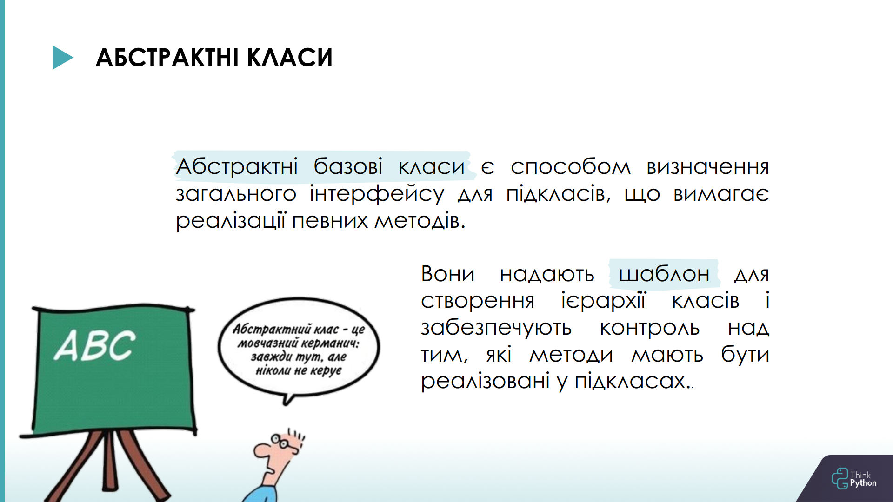

#### Переваги абстрактних базових класів

По-перше, абстрактні класи допомагають структурувати код, відокремлюючи визначення інтерфейсу від деталей реалізації, що 
призводить до створення більш модульного і зручного в обслуговуванні коду. Абстрактні класи - хороший механізм повторного 
використання коду, особливо шаблонного коду або логіки, яка не зміниться для жодного або більшості підкласів. Найкраща 
стратегія тут - дозволити абстрактному класу (тобто батьківському класу) виконувати більшу частину роботи, а дочірнім 
класам - реалізовувати її особливості.
По-друге, абстрактні класи вимагають явного успадкування, що робить їх більш придатними для проектування інтерфейсів з 
нуля або для ситуацій, коли ви маєте контроль над ієрархією класів.

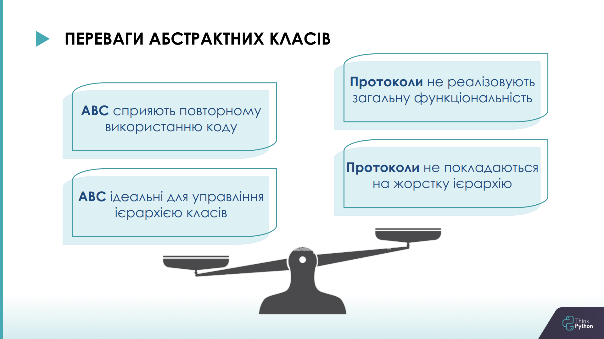

#### Переваги протоколів

Чому ж протоколи можуть бути кращими? Бо абстрактні класи у Python мають деякі недоліки. 
Першим ключовим обмеженням абстрактних класів є те, що їх не можна застосовувати заднім числом до наявних класів. 
Інакше кажучи, якщо у вас вже є клас, і ви хочете зробити його сумісним з абстрактним базовим класом, вам потрібно буде 
змінити ієрархію класів і явно успадковувати від абстрактного базового класу. У певних ситуаціях це може бути непрактично 
або навіть неможливо. 
І друге - абстрактні класи не підходять для визначення інтерфейсів для вбудованих типів або сторонніх бібліотек без зміни 
їхнього коду. Щоб подолати ці обмеження, Python представив протоколи, які забезпечують більш гнучкий підхід до визначення 
інтерфейсу. Протоколи дозволяють вам вказати очікувані методи та атрибути, які повинен мати клас, не вимагаючи явного 
успадкування або змін в ієрархії класів.
Крім того, протоколи можна використовувати для визначення інтерфейсів для вбудованих типів, сторонніх бібліотек або 
класів, які не перебувають під вашим контролем. Ця можливість особливо цінна в ситуаціях, коли зміна наявних класів 
або їхньої ієрархії успадкування неможлива.

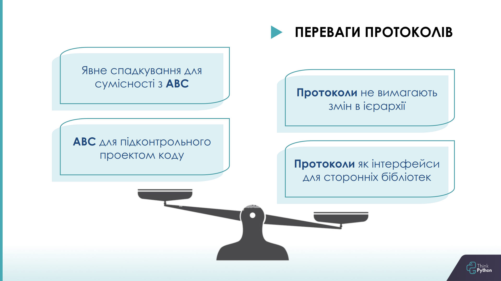

Давайте тепер все це подивимося на прикладі, щоб точно зрозуміти. 
Будемо розглядати приклад з ієрархією класів з абстрактним базовим класом у ролі батьківського та приклад з протоколом.

<table>
<tr>
<td><center><strong> Протоколи </strong></center></td> 
<td><center><strong> Абстрактні класи </strong></center></td> 
</tr>
<tr>
<td>

```python
from typing import Protocol, runtime_checkable


@runtime_checkable
class Animal(Protocol):
    category: str

    def sound(self) -> str:
        pass

    def eat(self, food: str) -> str:
        pass


class Dog:
    category = 'pet'

    def sound(self) -> str:
        return (
            f'Dog with category {self.category} '
            f'sound like Woof woof!'
        )

    def eat(self, food: str) -> str:
        return (
            f'Dog with category {self.category} '
            f'eat {food}'
        )


def make_sound(animal: Animal):
    return animal.sound()


print(make_sound(Dog()))
print(isinstance(Dog(), Animal))
```
</td>
<td>

```python
from abc import ABC, abstractmethod


class Animal(ABC):
    category: str

    @abstractmethod
    def sound(self) -> str:
        pass

    def eat(self, food: str) -> str:
        return 'Eat default'


class Dog(Animal):
    category = 'pet'

    def sound(self) -> str:
        return (
            f'Dog with category {self.category} '
            f'sound like Woof woof!'
        )

    def eat(self, food: str) -> str:
        return (
            f'Dog with category {self.category} '
            f'eat {food}'
        )


def make_sound(animal: Animal):
    return animal.sound()


print(make_sound(Dog()))
print(isinstance(Dog(), Animal))
```
</td>
</tr>
</table>

1) Абстрактні базові класи успадковуються від `ABC`, у той час як протоколи - від `Protocol` з методі `typing`.

2) Зазвичай протоколи не мають реалізації методів за замовчуванням, а для абстрактних класів це стандартна практика, 
вони часто використовуються у тому числі для того, щоб реалізувати спільну для класів-послідовників логіку.

3) Абстрактні класи покладаються на номінальну підтипізацію, а протоколи - на структурну. Це саме те, про що ми говорили 
на початку.
Для номінальної типізації, нагадую, характерне визначення типу даних згідно з їхніми іменами, а не з їхнім вмістом або 
структурою. У випадку ієрархії з абстрактним класом ми побачимо помилку від `mypy`, якщо `Dog` не буде успадковуватися 
від `Animal`, тобто функція `make_sound()` не зможе отримати тип, що очікує, хоча, з протоколами такої проблеми немає,
хоча `Dog` явно не успадковується від класу-протоколу.
У випадку протоколів ми побачимо помилку від `mypy`, якщо не виконаємо правило структурної типізації: типи збігаються, 
якщо вони мають однакові структури або форми даних. Тобто прибравши, наприклад, метод `sound()` з класу `Dog`, ми 
побачимо помилку від `mypy`. Хоча за таких самих дій з ієрархією класів (прибрати метод `sound()` з класу `Dog`) помилки 
від `mypy` не буде.

4) Наступна відмінність - у абстрактних класів є обмеженням: їх не можна застосовувати заднім числом до наявних класів, 
тобто якщо у нас вже є окремий, ні від чого не успадкований клас `Dog`, і ми хочете зробити його сумісним з абстрактним 
базовим класом `Animal`, нам необхідно буде змінити ієрархію класів і явно успадковувати від `Animal`. Протоколи 
дозволяють вказати очікувані методи та атрибути, які повинен мати клас, не вимагаючи явного успадкування або змін в 
ієрархії класів.

5) Перевірки відповідності об'єктів тому чи іншому інтерфейсу на етапі виконання програми. Для ієрархії з абстрактним 
класом все буде працювати, як ми звикли (`isinstance(Dog(), Animal)`), а для перевірки відповідності об’єкту певному 
протоколу слід написати декоратор `@runtime_checkable`.

6) І остання та найбільш явна відмінність: протоколи можна використовувати для визначення інтерфейсів для вбудованих 
типів, сторонніх бібліотек або класів, які не перебувають під вашим контролем. Мається на увазі, що класу `Dog` 
може не бути у вашому коді, а це, припустимо, буде клас зі сторонньої бібліотеки, що ви маєте намір використати. 
І створивши протокол та вказавши, що ви очікуєте у функції `make_sound()` об’єкт, що підпорядковується цьому протоколу, 
ви явно зазначите, що очікуєте щось, що точно матиме метод `sound()`, і це вже не буде чорним ящиком, і не потрібно 
буде думати, що ж там прийде з цієї сторонньої бібліотеки. Тож ця можливість особливо цінна в ситуаціях, коли зміна 
наявних класів або їхньої ієрархії успадкування неможлива (сторонні бібліотеки чи класи не є подконтрольним нам кодом,
ї ми не можемо змінити його). Тож у даному випадку абстрактні класи програють, за допомогою них таке зробити неможливо.

```python
from third_party_library import Dog
from typing import Protocol


class Animal(Protocol):
    category: str

    def sound(self) -> str:
        pass

    def eat(self, food: str) -> str:
        pass


def make_sound(animal: Animal):
    return animal.sound()


print(make_sound(Dog()))
```

#### Отже

Давайте підіб’ємо підсумки, коли слід застосовувати протоколи, а коли треба ухвалити рішення про використання абстрактних
класів. 

Якщо вам потрібен високий ступінь гнучкості й адаптованості під час визначення інтерфейсів, протоколи - гарний 
вибір. Вони допускають реалізацію заднім числом і сумісність між різними типами. З іншого боку, якщо вам необхідно 
забезпечити дотримання певного інтерфейсу в ієрархії класів, абстрактні класи надають структурований підхід для цього.

Якщо вам необхідно зробити наявні класи сумісними з інтерфейсом, протоколи пропонують більш практичне рішення. Ви можете 
заднім числом реалізувати необхідні методи й атрибути, не змінюючи ієрархію класів. З іншого боку, абстрактні класи
вимагають явного успадкування, що робить їх більш придатними для проектування інтерфейсів з нуля 
або для випадків, коли ви маєте контроль над ієрархією класів.

Протоколи можуть бути корисні для визначення інтерфейсів для вбудованих типів або сторонніх бібліотек без зміни їхнього 
коду. Це робить протоколи цінним інструментом у сценаріях, де зміна наявних класів або їхньої ієрархії успадкування 
неможлива або небажана. Абстрактні класи програють у даному випадку, вони можуть працювати лише з підконтрольним кодом.

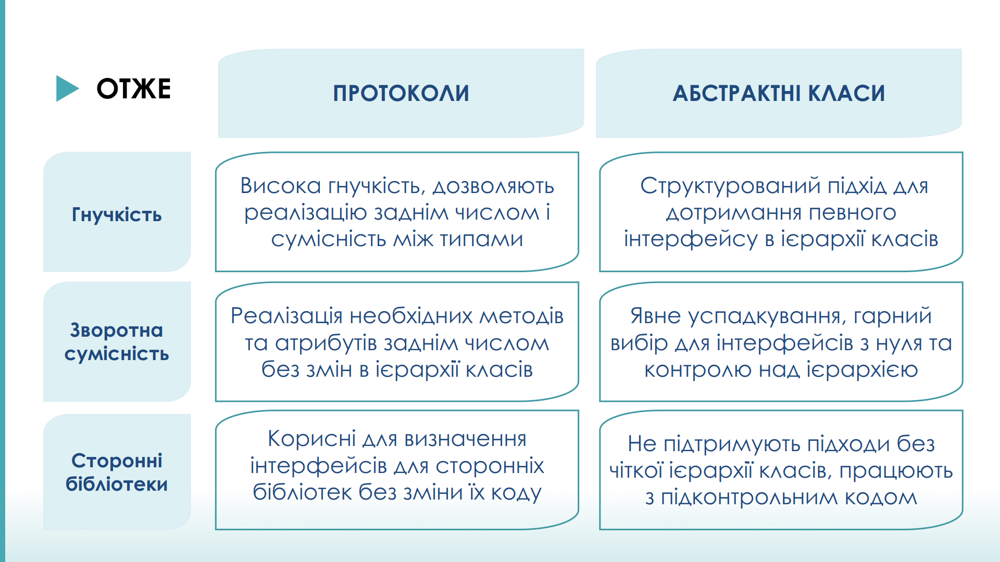
